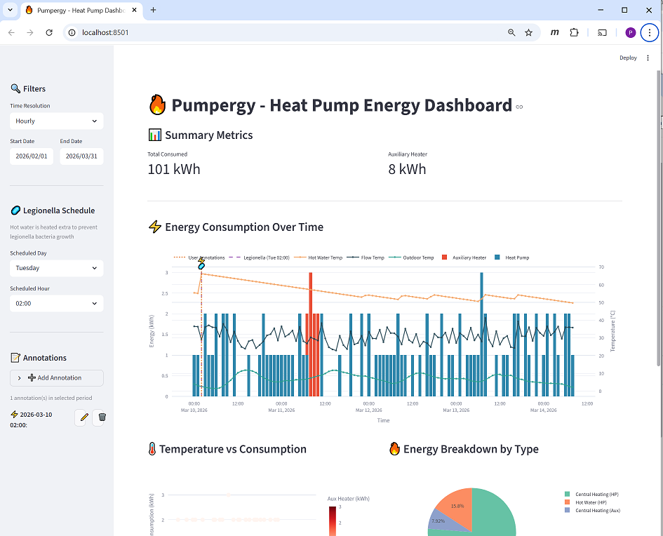

# Pumpergy



A dashboard to visualize and explore heat pump energy consumption over time, particularly highlighting when auxiliary heating has been in effect.  
Uses CSV data exported from the[ IVT Anywhere II](https://www.google.com/search?q=ivt+anywhere+ii) app.

[Python](https://www.python.org/) application using [Streamlit](https://streamlit.io/) for visualization
and [SQLite](https://sqlite.org) for storage.

## Features
- **Persistent storage** - New imports merge with existing data without loss. Overlapping imports are handled gracefully.
- **Google Drive integration** - Optionally download CSV exports directly from Google Drive instead of local file system.
- **Time-based filtering** - View hourly, daily, or monthly aggregations with custom date ranges
- **Energy visualizations**:
  - Consumption over time (Heat Pump vs Auxiliary Heater)
  - Temperature vs consumption correlation
  - Energy breakdown by type (Central Heating, Hot Water)
- **Auxiliary heater monitoring** - Flags unexpected usage outside scheduled times (like the Legionella prevention typically at 2AM on Tuesdays).
- **Custom annotations** - Add notes to specific times with icons (fuse issue, extra warm water requested, maintenance, etc.)

## Usage
### 1. Data retreival
Export data from IVT Anywhere II  
`Energy Monitoring -> ⓘ down to the right -> Download data`  
and share (typically to a cloud file storage or a local Downloads folder).

The app only provides last 3 days worth of hourly resolution, so to acheive that
one needs to do this at least every 3rd day.

💡 I'd love to know if there are easier ways to retrieve data from the [K 40 RF](https://docs.bosch-homecomfort.com/download/pdf/file/6721874402.pdf) unit,  see [discussion](https://github.com/perfnurt/pumpergy/discussions/1).

### 2. Run the dashboard
```bash
./run.sh            # start the dashboard without collecting any new files
./run.sh --dl       # collect CSV files from the ~/Downloads folder
./run.sh --gdrive   # collect CSV files from Google Drive
```
- First run:   
  -  Sets up a virtual Python environment
  -  Installs dependencies
- Imports the CSV files (if any)  
  CSV files in `data/` are consumed and deleted after successful import.  
  Multiple imports with overlapping or missing data are handled gracefully.
- Starts the Streamlit server and opens the browser connected to it.

## Project Structure
```
pumpergy/
├── app.py                  # Streamlit dashboard
├── downloader_google.py    # Google Drive CSV downloader
├── downloader_google.json  # Google Drive config & credentials (gitignored)
├── run.sh                  # Entry point script
├── requirements.txt
├── data/                   # CSV drop folder (content deleted when consumed)
├── pumpergy.db             # SQLite database (auto-created, gitignored)
└── src/
    ├── models.py           # Database schema
    └── importer.py         # CSV parser
```
## Google Drive Integration
Prerequisites:
- Google Cloud [service account](https://docs.cloud.google.com/iam/docs/service-account-overview) with [Drive API](https://developers.google.com/workspace/drive/api/guides/about-sdk) enabled.
- Service account [JSON credentials](https://developers.google.com/workspace/guides/create-credentials#create_credentials_for_a_service_account) copied into  `downloader_google.json`.
- Two folders in Google Drive that the service account has write access to.  
  The actual names are not important but something like:
  - `Pumpdata` for the CSV exports from IVT Anywhere II 
  - `PumpdataArchive` CSV moved here after being processed.

The `downloader_google.json` is to hold the necessary configuration, not versioned for obvious reasons, structured like:
```jsonc
{
  "folderId": "...", // folder id where CSV exports are located
  "archiveFolderId": "...", // folder id where processed CSVs are moved to
  "serviceAccount": { ... } // the service account JSON credentials
}
```
