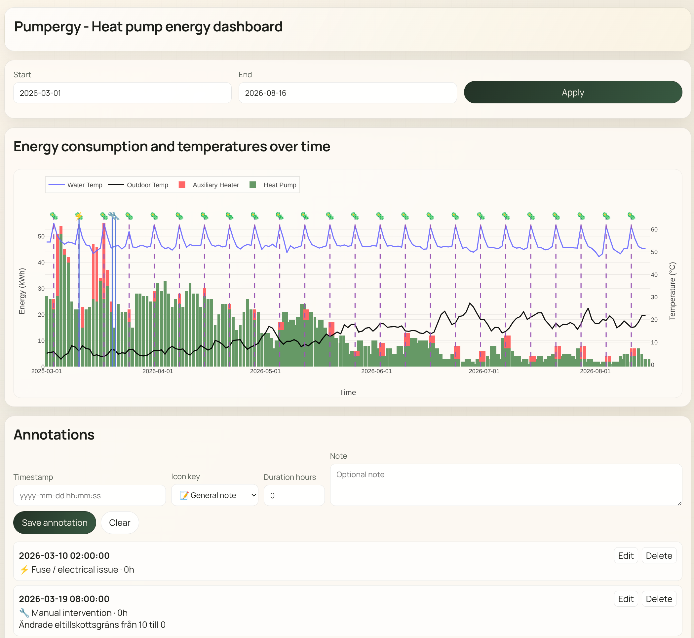

# Pumpergy



A PHP/MariaDB web dashboard to visualize and explore heat pump energy consumption over time, with extra focus on auxiliary heating events.

Data is imported from CSV files exported by [IVT Anywhere II](https://www.google.com/search?q=ivt+anywhere+ii).

## Features
- **Persistent storage** - New imports merge with existing data without loss. Overlapping imports are handled gracefully.
- **Google Drive integration** - Import CSV exports directly from Google Drive into the DB.
- **Energy visualizations**:
  - Consumption over time (Heat Pump vs Auxiliary Heater)
  - Temperature vs consumption correlation
  - Energy breakdown by type (Central Heating, Hot Water)
- **Auxiliary heater monitoring** - Flags unexpected usage outside scheduled times (like the Legionella prevention typically at 2AM on Tuesdays).
- **Custom annotations** - Add notes to specific times with icons (fuse issue, extra warm water requested, maintenance, etc.)


### Data retrieval
Export data from IVT Anywhere II  
`Energy Monitoring -> ⓘ down to the right -> Download data`  
and share to a Google Drive folder. 

The app only provides last 3 days worth of hourly resolution, so to acheive that
one needs to do this at least every 3rd day. Pumpergy will gracefully handle files having different resolutions (i.e. Downloading last 3 months for getting daily resolution works) to cover for when/if one misses the *every 3rd day ceremony*.

💡 I'd love to know if there are easier ways to retrieve data from the [K 40 RF](https://docs.bosch-homecomfort.com/download/pdf/file/6721874402.pdf) unit,  see [discussion](https://github.com/perfnurt/pumpergy/discussions/1).

Pumpergy imports the csv files to its DB (with some threshold as to not do it too often). 


## Project Structure
```
pumpergy/
├── deploy.sh
├── .deploy-config-<target>.sh # Not versioned. Settings for deplopyng the app to <target>, see/run deplpy.sh for details/creation.
├── creds.php.example       # Template file to copy to webroot(apps/creds.php)
├── db/
│   └── dbschema.sql        # The DB schema
└── webroot/
    ├── app/                # PHP app core (bootstrap, db, services, repos)
        ├── creds.php       # Not versioned. Holds credentials to DB and Google Drive
    ├── index.php
    ├── sync.php
    ├── readings.php
    ├── annotations.php
    └── settings.php
```

## Google Drive Integration
Prerequisites:
- Google Cloud [service account](https://docs.cloud.google.com/iam/docs/service-account-overview) with [Drive API](https://developers.google.com/workspace/drive/api/guides/about-sdk) enabled.
- Service account [JSON credentials](https://developers.google.com/workspace/guides/create-credentials#create_credentials_for_a_service_account) pecified in `app/creds.php`.
- Two folders in Google Drive that the service account has write access to.  
  The actual names are not important but something like:
  - `Pumpdata` for the CSV exports from IVT Anywhere II 
  - `PumpdataArchive` CSV moved here after being processed.
